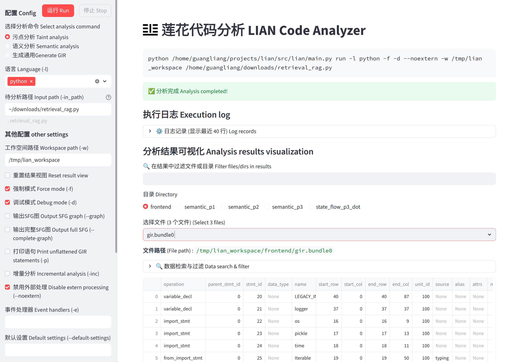

# The Lian Program Analysis Framework

**Lian** is a next-generation, high-precision program analysis framework designed for multi-language environments. It aims to deliver unified and powerful program analysis capabilities across diverse programming languages, including pointer analysis, dataflow analysis, and taint analysis.

## Background

Program analysis is a foundational technology in system security. The prior program analysis tools designed for mainstream statically typed languages (such as C/C++ and Java) are already highly mature and robust. However, in today's diverse programming language ecosystem, high-precision program analysis capabilities remain severely lacking, significantly hindering the analysis and enhancement of software security and reliability.

In past, many programming languages have become extremely popular:

- **Python** dominates artificial intelligence and data engineering;
- **TypeScript** became the #1 most-used language on GitHub in 2025. jointly with **JavaScript**, they power web and cross-platform application development;
- **Go** and **Rust** play critical roles in cloud services and systems programming.

Yet, traditional analysis tools still struggle to support these languages effectively:

- **Tight language binding**: Analysis logic is deeply coupled with the syntax and type systems of specific languages (e.g., C/C++, Java). Supporting a new language often requires rebuilding the entire system from scratch.
- **Failure under dynamic behavior**: Analysis algorithms heavily rely on stable object layouts and explicit type declarations. When analyzing untyped code or programs with dynamically evolving object structures, they either produce overly coarse approximations or suffer from state explosion.

## Unified Program Analysis

Lian lies in semantic consistences. Despite vast syntactic differences across languages, program behaviors at the execution level can all be reduced to a common set of semantic operations, enabling unified analysis.

- **Generic Intermediate Representation (GIR)**: A concise and universal IR that supports both statically and dynamically typed languages. Translating any source language into GIR requires only ~1,600 lines of code.
  
- **Unified Analysis Engine**: High-precision pointer analysis, dataflow analysis, and taint analysis are implemented atop GIR. The framework provides an extensible plugin architecture to support custom analyses.

## Key Features

* **Source-code input**: Analyzing source code directly. No compiler is required.  
* **Multi-language support**: Supporting both static and dynamic languages, including Python, JavaScript, Java, TypeScript, and Go.  
* **Pointer-level precision**: Implementing flow-sensitive and context-sensitive pointer analysis.  
* **Dynamic semantics modeling**: Accurately handling prototype chains, higher-order functions, and dynamic property resolution.  
* **Security-oriented**: Providing a powerful taint analysis engine, enabling rapid development of vulnerability discovery tools.

## Usage

### System Requirements

* Linux environment  
* Python 3.10+

### Download and Install

Clone the repository:

```shell
$ git clone https://github.com/yang-guangliang/lian.git
$ cd lian
```

Install dependencies:

```shell
$ pip install -r requirements.txt
```

### Running Lian

Lian supports both a graphical user interface and command-line mode:

**1. Launching the visual analysis tool:**

```shell
$ ./scripts/lian-ui.sh
```

<kbd></kbd>

**2. Performing analysis via command line:**

```shell
$ ./scripts/lian.sh -l <language> <path_to_code>
```

## Documentation and Support

For more technical details, please refer to [Documentation](https://yang-guangliang.github.io/lian/en). Also, we provide [Lecture Notes on Program Analysis](https://yang-guangliang.github.io/lian/en/02.background/2-1.basics/) (covering fundamentals, dataflow analysis, pointer analysis, and taint analysis), as a reference.

Feel free to submit feedback and suggestions via [Issues](https://github.com/yang-guangliang/lian/issues),[Discussions](https://github.com/yang-guangliang/lian/discussions), and [Pull Requests](https://github.com/yang-guangliang/lian/pulls)!

## Project Status

Lian is an active and research-driven project. Lian is independently developed by the [SSR (System Security and Reliability) research group](https://yang-guangliang.github.io/) at Fudan University. We are committed to building a generic, scalable, and high-precision program security analysis infrastructure.

