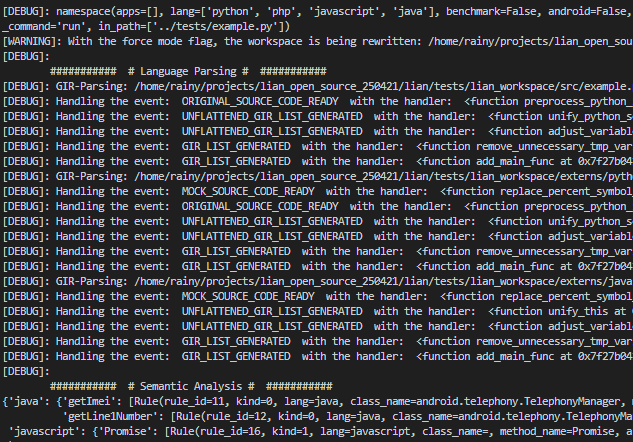

# Simple Example
```
# example.py
def callee(a):
    b = a["x"]
    #vulnerable_function
    b["func"] = lambda x : print("vulnerable")
    
o = {
    "x" : {}
}

def caller():
    p = o["x"]
    # benign_function
    p["func"] = lambda x : print("benign")
    callee(o)
    target = p["func"]
    target()

caller()
```

# Run With LIAN
```
scripts/test.sh <example.py> # only for test
```
----
# Screenshot of Execution
<br>
.png)

----
# GIR Results
## callee Function Definition<br>
.png)<br>
## caller Function Definition<br>
.png)<br>
## %unit_init Function Definition<br>
.png)<br>
----
# Interpretation of Results
From the GIR table (gir.bundle0), it can be seen that the call *target()* statement corresponds to the 55th GIR_stmt.<br>
.png)<br>
After running LIAN, the state space of the program (s2space_p3.bundle0) is generated. In this state space, for the 55th GIR_stmt, the state index in the *target* variable is 61.<br>
.png)<br>
By searching the state space (s2space_p3.bundle0) for the state with index 61, we find that its data_type is a method declaration, and its value of 27 represents the GIR_stmt_id of this method declaration.<br>
.png)<br>
Checking the GIR, the 27th GIR_stmt corresponds to the malicious method %mm1, indicating that this state was successfully computed.<br>
.png)<br>
