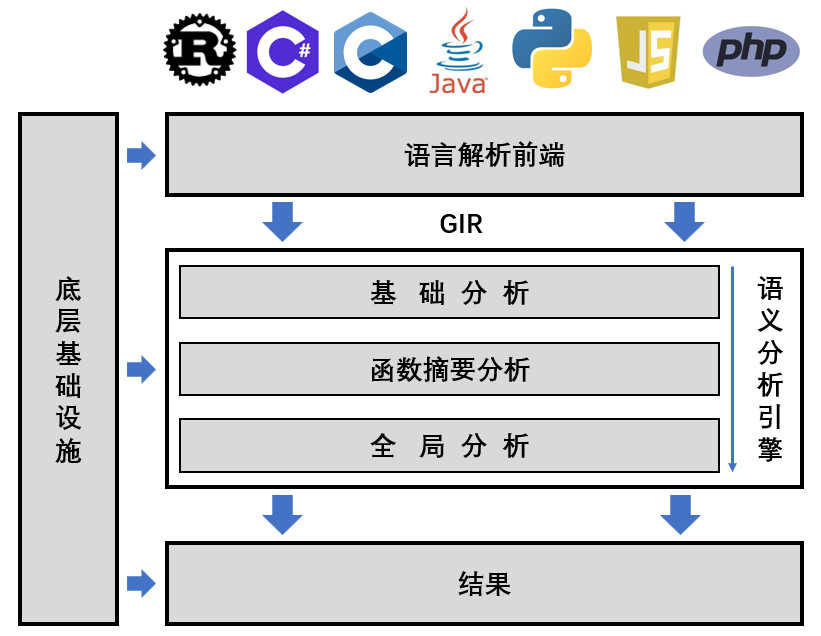

## **背景**

​		静态分析是理解软件代码行为和分析软件潜在安全的重要方法。近年来，随着软件代码量的急剧增加，多语言异构编程、动态语法特性等技术的普及和广泛应用，软件行为呈现出多样化和复杂化的趋势，静态分析面临巨大挑战。尤其是在处理动态语言时，这一问题更加凸显。已有的静态分析工具通常侧重于维护分析结果的 soundness，导致结果中存在大量近似数据，面临严重的精度问题——有价值的安全发现常常淹没在大量无意义的结果中，严重影响了这些工具的实用性。一部分工具尝试引入动态运行时结果来增强静态分析，但由于动态分析受限于覆盖率，导致静态分析往往只能得到部分增强。因此，提升静态分析精度是当前软件安全领域亟需解决的关键问题。

## **莲花系统**

​		针对这一关键问题，我们自主研发了高精度通用软件安全分析平台——LIAN莲花系统，通过抽象解释模拟计算运行时状态，并兼顾静态分析的高覆盖率，实现对软件安全分析。LIAN拥有诸多强大特性：

- 端到端一键运行。无需复杂的环境配置和修改源码，只需指定要分析的目录或文件，LIAN就能分析提供调用图、控制流图和程序的状态空间等分析结果，并能提供一定可视化展示；同时，输入既可以是完整程序代码，也可以是库文件代码；
- 方便、快速支持多种编程语言，不仅涵盖Java、C等静态语言，同时能够支持Python、JavaScript、PHP等动态语言；此外，还兼容移动字节码格式(如安卓Dalvik)和中间语言(如llvm)；
- 设计新型统一中间语言GIR，LIAN的语言前端能够将多种语言转换为GIR进行高精度语义分析；
- 在GIR基础上，实现了语义分析，包括类型层级分析、文件依赖分析、控制流、跨函数数据流分析；
- 同时，实现了上下文敏感、流敏感、域敏感、分支敏感的程序运行时状态计算，能够支持多种语义分析，如污点跟踪、调用图构建等；
- 中间结果和最终结果保存于底层数据库，易于查询和利用；
- 底层实现了基于事件的插件系统便于对系统进行修改和扩展，并提供内存和文件管理系统，避免内存爆炸。

## **架构**

​		从技术架构来说，LIAN 系统由三大核心模块构成，如下图：

- [语言前端](lang_parser.md)：将输入代码内容转换为中间表示 [GIR](gir.md)，实现对输入的标准化处理；
- 语义分析引擎：采用分层递进的分析策略，依次进行[基础分析](basic_analysis.md)、[基于函数摘要分析](summary_generation.md)、[全局分析](global_analysis.md)，最终生成包含程序控制流、数据流、状态流等多层次语义分析结果；
- 底层基础设施：包括[管理内存和文件系统](loader.md)（防止内存不足）、[插件系统](plugin.md)（易于扩展）。
